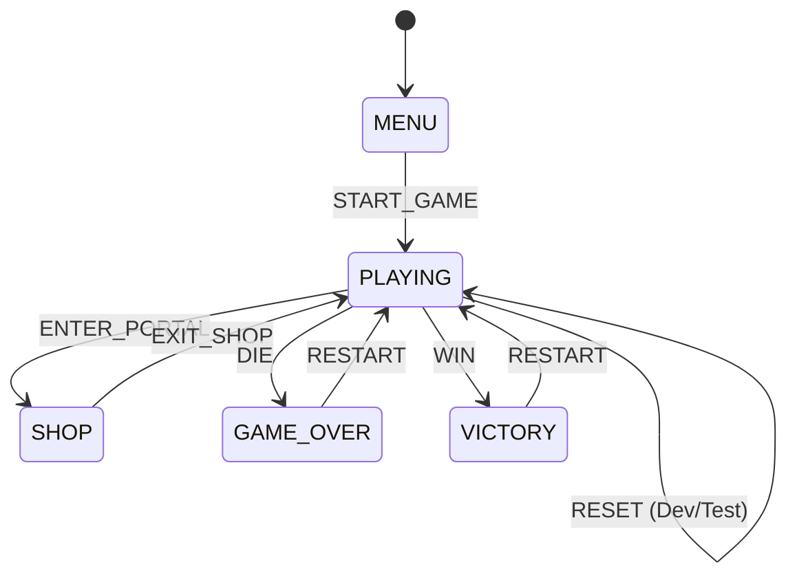

# STORE_API.md

> 📦 Especificación de la API del Store (Zustand) – alineado con [TASK.MD](./TASK.MD) (fuente de verdad del proyecto)
> Relacionado: TASK-012, TASK-018

## 1. Introducción y Objetivo
El Store es el cerebro reactivo de Calamar Loco. Utiliza **Zustand** para gestionar el estado global, la persistencia y la lógica de juego. Esta especificación define la estructura del "God Store" actual y su plan de refactorización hacia una arquitectura basada en **Slices**.

---

## 2. Definición del Estado (Zustand)

### A) GameState (Dominio de Juego)
| Propiedad | Tipo | Descripción |
| :--- | :--- | :--- |
| `status` | `GameStatus` | FSM: `MENU`, `PLAYING`, `SHOP`, `GAME_OVER`, `VICTORY`. |
| `score` | `number` | Puntos acumulados en la partida actual. |
| `lives` | `number` | Cantidad de golpes permitidos antes del `GAME_OVER`. |
| `distance` | `number` | Metros recorridos en la run actual. |
| `letters` | `string[]` | Array de letras del nombre "CALAMARLOCO" recogidas. |

### B) PlayerState (Dominio del Jugador)
| Propiedad | Tipo | Descripción |
| :--- | :--- | :--- |
| `gems` | `number` | Moneda persistente (soft currency) para la tienda. |
| `upgrades` | `Object` | Registro de habilidades compradas (ej. `doubleJump: boolean`). |
| `highScore` | `number` | Récord máximo guardado en `localStorage`. |

---

## 3. Máquina de Estados (FSM) - [IMPLEMENTADO ✅]

El `GameStatus` se gestiona mediante una FSM estricta definida en `src/features/game/state/store.ts`. Las transiciones solo son posibles si están definidas en la `VALID_TRANSITIONS` matrix.

### Matriz de Transiciones
| Estado Actual | Evento / Acción | Estado Siguiente |
| :--- | :--- | :--- |
| `MENU` | `startGame()` | `PLAYING` |
| `PLAYING` | `openShop()` (Portal) | `SHOP` |
| `PLAYING` | `takeDamage()` (lives=0) | `GAME_OVER` |
| `PLAYING` | `collectLetter()` (Final level) | `VICTORY` |
| `PLAYING` | `restartGame()` (Reset) | `PLAYING` |
| `SHOP` | `closeShop()` | `PLAYING` |
| `GAME_OVER` | `restartGame()` | `PLAYING` |
| `VICTORY` | `restartGame()` | `PLAYING` |

### Diagrama de Estados

---

## 4. Acciones (Public API)

### Lógica de Juego
- `startGame()`: Transiciona a `PLAYING` y resetea temporizadores.
- `collectLetter(letter: string)`: Agrega letra al array. Si es la última, transiciona a `VICTORY`.
- `takeDamage()`: Reduce `lives`. Si es 0, transiciona a `GAME_OVER`.
- `updateDistance(delta: number)`: Incrementa la distancia recorrida.

### Tienda y Persistencia
- `purchaseUpgrade(id: string, cost: number)`: Verifica `gems >= cost`, debita y activa habilidad.
- `saveRecord()`: Compara `score` con `highScore` y persiste en memoria/disk.

---

## 5. Persistencia (Middleware)
El store utiliza el middleware `persist` de Zustand para sincronizar automáticamente el estado del jugador con el navegador.
- **Key:** `calamar-loco-storage`
- **Whitelist:** `gems`, `upgrades`, `highScore` (el estado de la partida no se persiste).

---

## 6. Criterios de Calidad (TASK-012)
- **Typed Actions:** Todas las acciones deben estar tipadas en TypeScript.
- **Selector Pattern:** Los componentes deben consumir el store usando selectores para minimizar re-renders.
- **Immutability:** Uso estricto de `set()` con patrones inmutables.

---
🔗 Referencia: [TASK.MD](./TASK.MD) | [PROJECT_STRUCTURE.md](./PROJECT_STRUCTURE.md)
Última actualización: 17/12/2025
